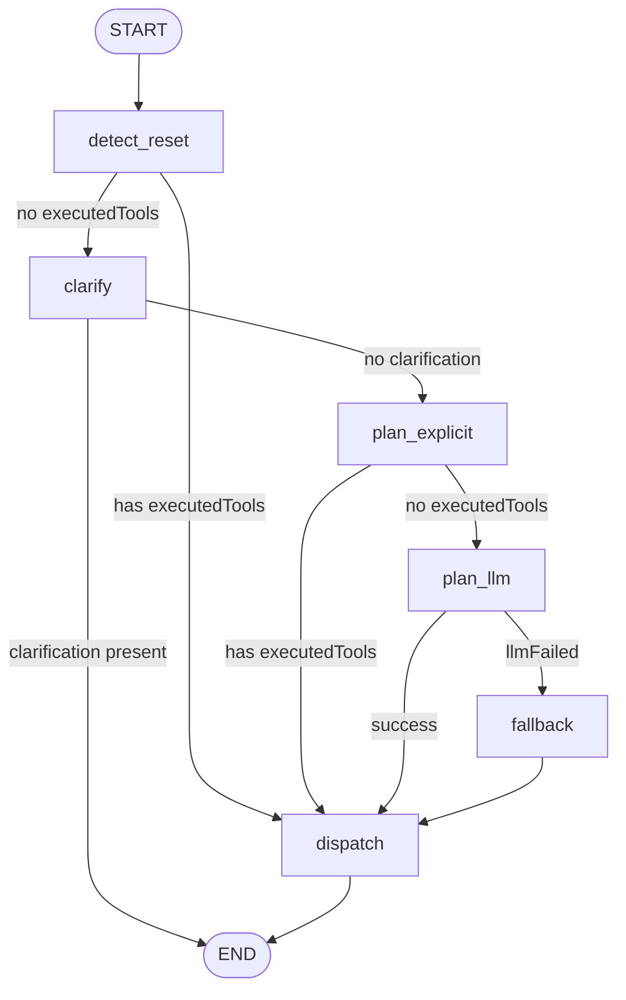

# PLM MCP Server

A lightweight HTTP/WebSocket server and browser UI for interactive multi-command planning (MCP) with a Three.js preview.

Overview

This repository implements a small MCP runtime that accepts natural-language commands, plans actions with a LangGraph-based command workflow (optionally using an LLM), and sends executable 3D actions to a browser-based Three.js preview UI over WebSocket.

What this does

- Accepts user commands (chat-style) over WebSocket or HTTP.
- Attempts local intent parsing first for fast, deterministic actions.
- Falls back to an LLM planning step (via the configured OpenAI client) when explicit parsing doesn't match.
- Dispatches actions to the browser UI which applies them to a Three.js scene.

Quick start

1. Install dependencies:

```bash
npm install
```

2. Start the server:

```bash
npm start
```

3. Open the UI in your browser:

- Open `ui/index.html` directly in a browser. If your browser blocks local-file WebSocket connections, serve the `ui/` folder (for example `npx http-server ui`) and open the served page.

File layout (summary)

- server/
  - index.js — Server entry point (HTTP + WebSocket listeners)
  - command-graph.js — LangGraph-based command/workflow construction
  - intent.js — Local intent parsing and clarification helpers
  - tools.js — Definitions of browser-facing tools (names, input schemas)
  - browser-bridge.js — WebSocket bridge utilities to send actions to the browser
  - config.js — Runtime configuration (model name, temperature, token limits)
- ui/
  - index.html — UI entry page (Three.js canvas + chat controls)
  - app.js — Three.js scene setup and tool handlers
  - chat-ui.js — Chat UI and clarification controls
  - styles.css — UI styling
- server.js — Backward-compatible launcher
- docs/architecture.svg — Architecture diagram referenced above

Core concepts and how the command flow works

1. Incoming message: the server receives a natural language message from the user.
2. Reset detection & local parsing: lightweight checks (e.g., "reset", camera control) are applied first.
3. Clarification: if the message appears ambiguous, the workflow will set a clarification prompt.
4. Local explicit planning: the code attempts to match the message against local intent rules (fast, deterministic).
5. LLM planning: if local parsing didn't find actions, the workflow calls the configured LLM to produce tool-calls.
6. Fallback and dispatch: if the LLM fails, fall back to local parsing; finally, actions are sent to the browser via WebSocket.

LangGraph node diagram

The following Mermaid diagram visualizes the nodes and conditional transitions implemented in server/command-graph.js. It mirrors the logic: START -> detect_reset -> clarify/dispatch -> plan_explicit -> plan_llm -> fallback -> dispatch -> END.



This graph corresponds to the conditional edges and nodes in server/command-graph.js. The main nodes are:

- detect_reset: quick check for reset-camera or reset-scene commands.
- clarify: set a clarification prompt if the input is ambiguous.
- plan_explicit: parse and execute locally-known intents (no LLM needed).
- plan_llm: call the configured OpenAI client to generate tool-calls (LLM planning).
- fallback: fallback local parsing if the LLM call fails.
- dispatch: send the final actions to the browser UI over WebSocket.

Usage examples

Create the LangGraph command graph (server-side):

```js
// server/index.js (excerpt)
import { createCommandGraph } from "./server/command-graph.js";
import OpenAI from "openai";

const openai = new OpenAI({ apiKey: process.env.OPENAI_API_KEY });
const graph = createCommandGraph(openai);

// When you receive a user message, construct a minimal state object and run the graph.
const initialState = { message: "rotate the cube 45 degrees clockwise" };
// The StateGraph instance returned by createCommandGraph will be used to execute the nodes
// and produce a side effect (sending actions to the browser) and/or a reply string.
// Implementation detail: the StateGraph API is used internally by the server runtime in this repo.
```

WebSocket message (UI -> server) — simple example

```json
{
  "type": "user_message",
  "text": "Move the camera back and reset the scene"
}
```

Browser action format (server -> UI) — example action array sent over WebSocket:

```json
[
  { "name": "reset_scene", "args": {} },
  { "name": "set_camera", "args": { "position": [0, 5, 10], "lookAt": [0, 0, 0] } }
]
```

Notes about the command-graph implementation

- The Node definitions in server/command-graph.js implement a short-circuit pipeline: local rules first, then LLM planning. This reduces reliance on the LLM for trivial or deterministic commands.
- TOOL_DEFINITIONS in server/tools.js are transformed into function-like descriptors when the LLM is called, enabling function-calling style outputs that map to the browser toolset.
- The graph logs when dispatching actions and warns when the browser preview is not connected.

Contributing

If you'd like improvements to this README (more code examples, a PNG export of the LangGraph diagram, or a runtime sequence diagram), open an issue or a PR. I can also generate a changelog or add more explicit examples for the LLM call formatting.

License

MIT
