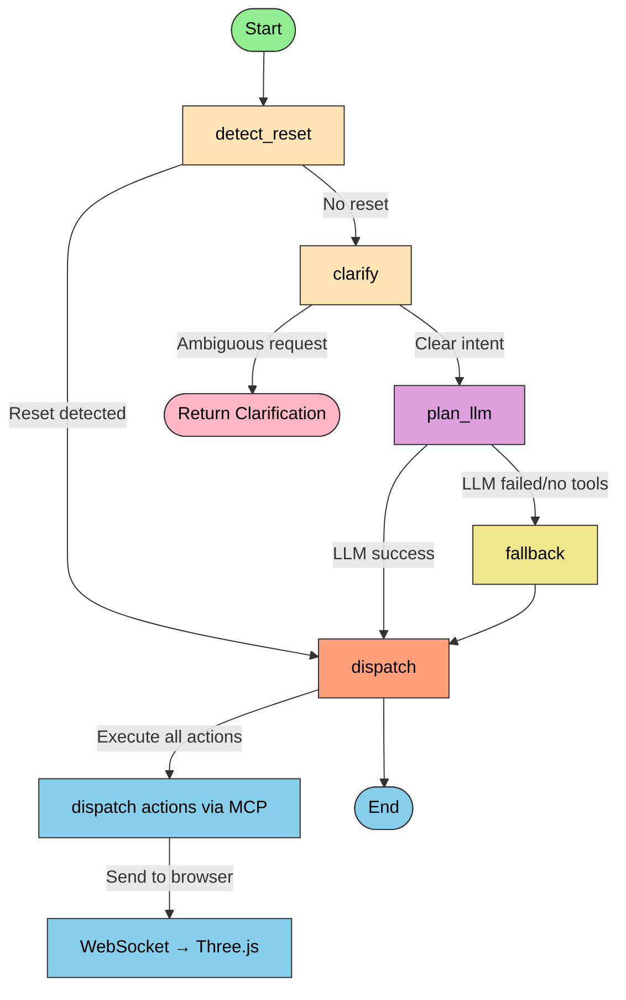

# PLM MCP Server

A lightweight HTTP/WebSocket server and browser UI for interactive multi-command planning (MCP) with a Three.js preview.

This project implements a small MCP runtime that accepts natural-language commands, plans actions using a LangGraph-based command workflow (local parsing first, then optional LLM planning), and dispatches executable actions to a browser preview.

## Highlights

- Accept chat-style commands over HTTP or WebSocket
- Fast local intent parsing for common commands (camera controls, reset, presets)
- Structured LLM-based planning (function-calling/tool-calls) as a fallback
- Sends executable actions (tool invocations) to a browser preview
- Exposes a Model Context Protocol (stdio) server for programmatic tool discovery and invocation
- Dynamic MCP tool discovery and execution
- Real-time agent status updates to the browser UI
- Fallback planning when LLM tool selection fails

## Quick Start

### 1. Install dependencies

```bash
npm install
```

### 2. Configure environment variables

Set any of these environment variables to customize behavior:

- `HUGGINGFACEHUB_API_TOKEN` or `HUGGINGFACE_API_KEY` — API key for the OpenAI-compatible LLM client
- `HUGGINGFACE_REPO_ID` or `MODEL_NAME` — Model ID to use (defaults to `Qwen/Qwen2.5-7B-Instruct`)
- `HUGGINGFACE_TEMPERATURE` or `TEMPERATURE` — LLM temperature override (default: 0.2)
- `HUGGINGFACE_MAX_NEW_TOKENS` or `MAX_NEW_TOKENS` — Max tokens for LLM completions (default: 512)
- `PORT` — HTTP/WebSocket server port (default: 8080)
- `DEBUG` — Enable debug logging (default: true)

Example `.env` file:

```
HUGGINGFACEHUB_API_TOKEN=your_token_here
MODEL_NAME=Qwen/Qwen2.5-7B-Instruct
TEMPERATURE=0.2
MAX_NEW_TOKENS=512
PORT=8080
DEBUG=true
```

### 3. Start the server

```bash
npm start
# or
node server/index.js
```

The server will start on the configured port (default `http://localhost:8080`).

### 4. Open the browser UI

- Open `ui/index.html` directly in a browser, or serve the `ui/` folder with:
  ```bash
  npx http-server ui
  ```
  
  Use `http-server` if your browser blocks local-file WebSocket connections.

## Server Behavior and API

### HTTP API Endpoint: POST `/api/chat`

**Request payload:**
```json
{
  "message": "rotate the cube 45 degrees clockwise",
  "history": []
}
```

**Response:**
```json
{
  "reply": "Rotating the cube 45 degrees clockwise.",
  "executedTools": [
    { "name": "rotate", "args": { "angle": 45 } }
  ]
}
```

Or, if clarification is needed:
```json
{
  "question": "Which plane should I rotate around?",
  "options": ["X", "Y", "Z"],
  "executedTools": []
}
```

### WebSocket: Real-time Browser Communication

- Server listens for a browser WebSocket connection
- Forwards executed tool actions to the connected preview in real-time
- Sends agent status updates during planning and execution
- If the preview is not connected when actions are dispatched, a warning is logged

**Browser action format (server → UI):**
```json
[
  { "name": "reset_scene", "args": {} },
  { "name": "set_camera_view", "args": { "preset": "Isometric" } }
]
```

**Agent status updates (server → UI):**
```json
{
  "status": "thinking",
  "message": "Understanding your PLM request...",
  "tool": null,
  "args": null
}
```

### Model Context Protocol (stdio)

A lightweight MCP-compatible server runs alongside the HTTP server, implementing:
- **ListTools** — Returns all available PLM tools
- **CallTool** — Executes a named tool with provided arguments

External controllers can discover and invoke tools via the MCP interface.

## LangGraph Node Diagram

The command workflow implemented in `server/command-graph.js` follows a prioritized, intelligent pipeline:



> Note: node text color has been set to black (`color:#000000`) to ensure readability across different backgrounds — this addresses readability issues when white text was used against light fills.

### Detailed Node Descriptions

| Node | Purpose | Key Actions |
|------|---------|------------|
| **detect_reset** | Fast-path for reset requests | Detects "reset" or "clear" keywords; short-circuits to dispatch if found |
| **clarify** | Ambiguity resolution | Asks follow-up questions for unclear intents; returns clarification or proceeds to LLM |
| **plan_llm** | LLM-based planning | Discovers MCP tools dynamically, sends user request + tools to LLM, extracts tool_calls |
| **fallback** | Local intent parsing | Uses regex/keyword matching from `intent.js` if LLM fails or returns no tools |
| **dispatch** | Tool execution | Iterates through executedTools, calls MCP client for each, collects results |

### Data Flow

```
User Message
    ↓
[detect_reset]  ← Fast local check
    ↓
[clarify]       ← Ambiguity detection
    ↓
[plan_llm]      ← Dynamic MCP tool discovery
    ├─ List MCP tools
    ├─ Convert to LLM function format
    ├─ Call LLM with user message
    └─ Extract tool_calls
    ↓
[dispatch]      ← Tool execution
    ├─ For each executedTool:
    │  ├─ Call MCP client
    │  ├─ Collect result/error
    │  └─ Send status to browser
    └─ Return actions & results
```

## Implementation Notes

### Local Intent Parsing (`server/intent.js`)

Fast, deterministic pattern matching for common commands:
- Camera manipulations (zoom, pan, rotate)
- Reset requests (clear, reset, restore)
- Preset camera views (isometric, top, front, etc.)
- Part isolation and highlighting

No LLM required for these operations — they execute instantly.

### LLM Planning (`server/command-graph.js` / `plan_llm`)

1. **Dynamic Tool Discovery**: Calls `listMcpTools()` to get the latest available tools
2. **Tool Format Conversion**: Converts MCP tool schemas to OpenAI function format
3. **LLM Invocation**: Sends user message + tools to the LLM (Qwen by default)
4. **Tool Call Extraction**: Parses the LLM response for `tool_calls` array
5. **Fallback on Failure**: If LLM returns no tools or fails, switches to fallback parsing

### MCP Client Integration (`server/mcp-client.js`)

- Connects to the MCP server (stdio)
- Implements `listMcpTools()` to discover available tools
- Implements `callMcpTool(toolName, args)` to execute tools
- Handles errors gracefully and returns results to the graph

### Browser Bridge (`server/browser-bridge.js`)

- Manages WebSocket connection to the browser UI
- Sends actions as JSON arrays
- Broadcasts agent status updates in real-time
- Buffers actions if the browser is temporarily disconnected

### Agent Status Updates

Real-time status messages are sent to the browser throughout the workflow:

| Status | When | Example Message |
|--------|------|-----------------|
| `thinking` | Planning in progress | "Understanding your PLM request..." |
| `tool_selected` | Tool chosen | "Rotating the cube 45 degrees..." |
| `executing` | Executing a tool | "Executing 1 operation..." |
| `completed` | Tool/workflow finished | "All requested operations completed." |
| `fallback` | Switched to fallback | "LLM planning failed. Using fallback..." |
| `error` | Error occurred | "I couldn't determine the required operation." |
| `clarification` | Asking for clarification | "Which part should I highlight?" |

## Runtime Configuration

All configuration options with defaults:

```javascript
// server/config.js
PORT = process.env.PORT || 8080
DEBUG = process.env.DEBUG !== 'false'
MODEL_NAME = process.env.MODEL_NAME || process.env.HUGGINGFACE_REPO_ID || 'Qwen/Qwen2.5-7B-Instruct'
TEMPERATURE = process.env.TEMPERATURE || process.env.HUGGINGFACE_TEMPERATURE || 0.2
MAX_NEW_TOKENS = process.env.MAX_NEW_TOKENS || process.env.HUGGINGFACE_MAX_NEW_TOKENS || 512
```

## Project Structure

```
plm_mcp_server/
├── .gitignore                ← Git ignore rules
├── .vscode/                  ← VSCode workspace settings (optional)
├── docs/                     ← Documentation and diagrams
│   └── architecture.svg
├── server/                   ← Server code (HTTP, WebSocket, MCP)
│   ├── index.js              ← Server entry point (HTTP + WebSocket + MCP)
│   ├── command-graph.js      ← LangGraph workflow definition
│   ├── intent.js             ← Local intent parsing & clarification
│   ├── tools.js              ← Tool definitions for MCP & LLM
│   ├── browser-bridge.js     ← WebSocket bridge to browser
│   ├── mcp-browser-bridge.js ← MCP ↔ browser bridge (helper)
│   ├── mcp-client.js         ← MCP client (stdio) for tool discovery/execution
│   ├── mcp-server.js         ← MCP server implementation (stdio)
│   ├── config.js             ← Runtime configuration
│   └── graph/                ← LangGraph graph helpers and nodes
├── ui/                       ← Browser UI and Three.js preview
│   ├── index.html            ← Browser entry page
│   ├── app.js                ← Three.js scene setup & tool execution
│   ├── chat-ui.js            ← Chat UI & clarification handlers
│   ├── scene-controller.js   ← Scene controls & interactions
│   └── styles.css            ← UI styling
├── package.json              ← Dependencies & scripts
├── package-lock.json         ← Exact dependency tree (lockfile)
├── server.js                 ← Backward-compatible launcher
└── README.md                 ← This file
```

## Key Dependencies

- **@langchain/langgraph** `^1.4.9` — LangGraph workflow orchestration
- **openai** `^7.4.0` — OpenAI-compatible LLM client (HuggingFace router)
- **@modelcontextprotocol/sdk** `^1.30.0` — MCP server & client implementations
- **ws** `^8.21.2` — WebSocket server for browser communication
- **@huggingface/inference** `^4.13.25` — HuggingFace model inference
- **dotenv** `^17.4.2` — Environment variable management

## Workflow Examples

### Example 1: Reset Request (Fast Path)

```
User: "Reset"
  ↓
[detect_reset] → Matches "reset" pattern
  ↓
[dispatch] → Sends reset_scene action
  ↓
Browser: Scene resets
```

### Example 2: Ambiguous Request

```
User: "Rotate 45"
  ↓
[detect_reset] → No match
  ↓
[clarify] → Detects ambiguity
  ↓
Returns: "Which axis: X, Y, or Z?"
```

### Example 3: LLM-Based Planning

```
User: "Find parts related to assembly A"
  ↓
[detect_reset] → No match
  ↓
[clarify] → Clear intent
  ↓
[plan_llm] → Discovers MCP tools
  → Calls LLM with user message + tools
  → LLM returns: tool_calls=[{name: "find_related_parts", args: {...}}]
  ↓
[dispatch] → Calls MCP tool
  ↓
Browser: Displays related parts
```

### Example 4: LLM Failure → Fallback

```
User: "Show me the assembly"
  ↓
[detect_reset] → No match
  ↓
[clarify] → Clear intent
  ↓
[plan_llm] → LLM returns no tools
  ↓
[fallback] → Local parsing succeeds (matches "show" → set_camera_view)
  ↓
[dispatch] → Sends camera view action
  ↓
Browser: Camera changes
```

## Usage Tips

1. **Fast Commands**: Use simple, direct language for camera controls and resets.
   - "Reset", "Zoom in", "Front view", "Isometric"

2. **Complex Queries**: Be descriptive for LLM planning.
   - "Find all parts related to the motor assembly"
   - "Create a cross-section along the XY plane"
   - "Highlight components from supplier A"

3. **Debugging**: Enable debug logs to see the LangGraph workflow in action.
   - Set `DEBUG=true` in `.env` or as an environment variable
   - Check browser console and server console for status messages

4. **Tool Discovery**: The LLM dynamically discovers available tools from the MCP server.
   - No hardcoded tool list — add new tools to the MCP server and the LLM will see them

## Architecture Diagram

```
┌─────────────┐
│   Browser   │
│  (Three.js) │
└──────┬──────┘
       │ WebSocket
       │
┌──────▼─────────────────────┐
│      HTTP Server           │
│  ┌──────────────────────┐  │
│  │   LangGraph Workflow │  │
│  │ (command-graph.js)   │  │
│  └───────┬──────────────┘  │
│          │                  │
│    ┌─────▼──────┐          │
│    │  MCP Client│          │
│    └─────┬──────┘          │
└─────────┼─────────────────┘
          │ stdio
          │
    ┌─────▼──────────────┐
    │   MCP Server       │
    │ (tool definitions) │
    └────────────────────┘
```

## Contributing

PRs and issues welcome! Some potential enhancements:

- [ ] Add streaming support for long-running operations
- [ ] Implement persistent session history
- [ ] Add Docker configuration for easy deployment
- [ ] Create more sophisticated clarification strategies
- [ ] Support for multiple concurrent browser connections
- [ ] Add telemetry and analytics

## License

MIT
